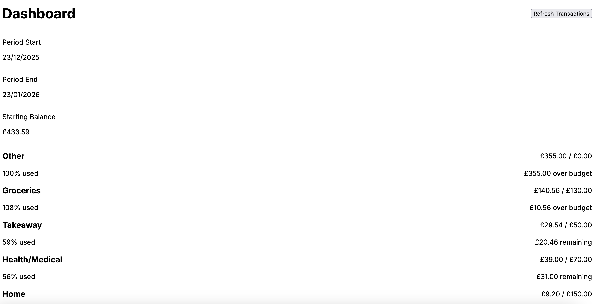
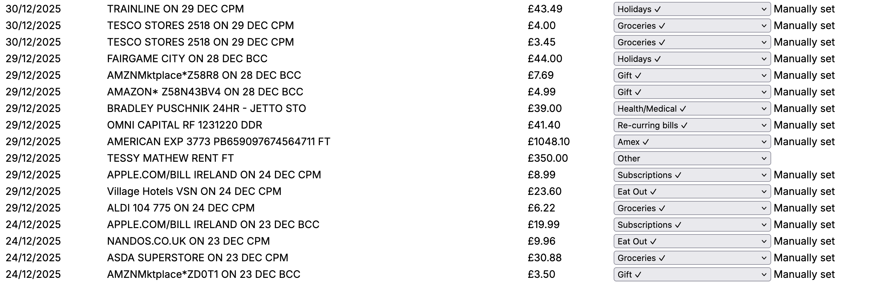
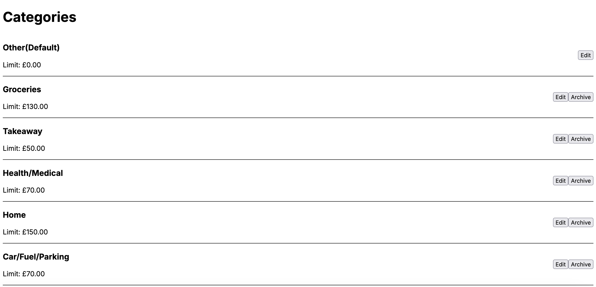

# Automated Budget (V1 – MVP)

Automated Budget is a **personal finance budgeting tool** that automatically imports bank transactions via Open Banking (TrueLayer), groups them into budget periods, and tracks category-level spending — with minimal manual input.

This repository represents **Version 1 (MVP)** and is primarily a **learning + proof-of-concept project**.  
It is **not production-ready** and **not intended for public use** without further development.

> ⚠️ **Important**: This project requires private API credentials (TrueLayer, Google OAuth).  
> Cloning this repo alone is **not sufficient** to run the app.

---

##  What This Project Does (V1)

- Securely connects to a UK bank via **TrueLayer (Open Banking)**
- Automatically fetches transactions for the active budget period
- Stores all user data **server-side in Google Drive** (no database)
- Deduplicates transactions using provider IDs
- Separates **income vs spending**
- Tracks spending per category against optional monthly limits
- Calculates a starting balance for each period
- Allows manual category overrides (preserved on refresh)
- Supports manual refresh + timed auto-refresh (12h window)

**Dashboard overview**  
**

**Transactions & categorisation**  
**
**

---

##  Architecture Overview

**Frontend**
- Next.js App Router (React, TypeScript)
- Tailwind CSS
- Client-side category editing
- Manual refresh controls

**Backend**
- Next.js Route Handlers (`/app/api/*`)
- Google Drive used as a file-based datastore
- TrueLayer Open Banking integration
- Token refresh + expiry handling

**Storage (Google Drive)**

---

## Budget Period Model (V1)

- **Fixed date monthly periods only** (e.g. 25th → 25th)
- Period settings are saved but **only applied to future periods**
- Current active period is immutable (by design)
- New period is created automatically when the date passes the end date

> Income-anchored periods are **intentionally disabled for V1**.

---

##  Refresh Logic

- Transactions are **not fetched on every page load**
- A refresh timestamp is stored
- Automatic refresh occurs if:
  - More than **12 hours** since last refresh
- Manual refresh button always available

This avoids excessive Open Banking calls while keeping data fresh.

---

##  Transaction Normalisation (V1)

- Merchant name removed for MVP (inconsistent across banks)
- Description is cleaned to remove:
  - Embedded dates
  - Bank-specific suffixes
- Transaction sign is normalised:
  - **Negative** = spending
  - **Positive** = income
- Income remains visible in transactions but is excluded from spend totals

---

##  Security Notes

- All secrets are stored in environment variables
- `.env*` files are gitignored
- OAuth tokens are stored **only in Google Drive**, not in Git
- No credentials or tokens are committed to the repository

Safe to publish **as code only**.

---

##  What This Repo Is *Not*

- ❌ A finished budgeting app
- ❌ A production-ready finance product
- ❌ A plug-and-play open-source tool
- ❌ Audited or hardened for public users

---

##  Known Limitations (V1)

- Single account only
- No historical period editing
- No multi-user support
- No forecasting or predictions
- No mobile optimisation
- No test coverage yet
- Requires manual Open Banking setup

---

##  Planned Future Work (V2+)

- Income-anchored periods
- Multi-account support
- Forecasting & trends
- Smarter auto-categorisation
- Balance reconciliation
- UI polish & mobile support
- Proper onboarding flow
- Background refresh jobs
- Database-backed storage

---

##  Motivation

This project was built to:
- Learn Open Banking flows end-to-end
- Explore non-database persistence (Drive as storage)
- Build a budgeting system that avoids manual entry
- Design a system that scales in complexity over time

---

##  License

This project is shared for **learning and reference purposes**.

No warranty. No guarantees. Use at your own risk.

---

##  Final Note

If you’re browsing this repo:  
Feel free to read, learn, and explore — but don’t expect it to “just work” without significant setup and understanding.